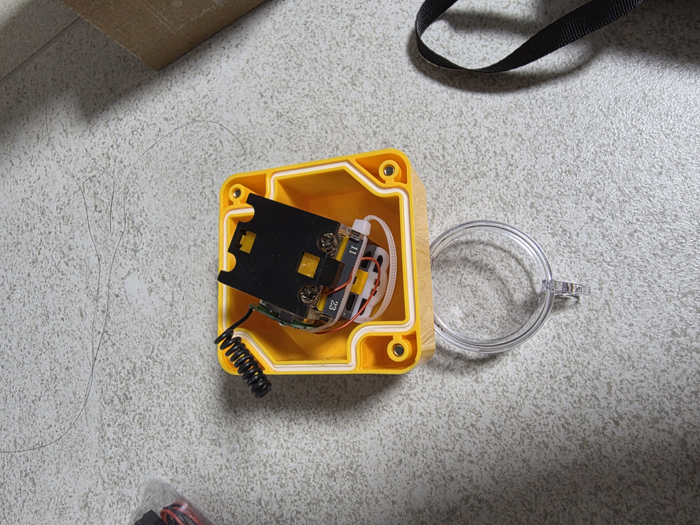
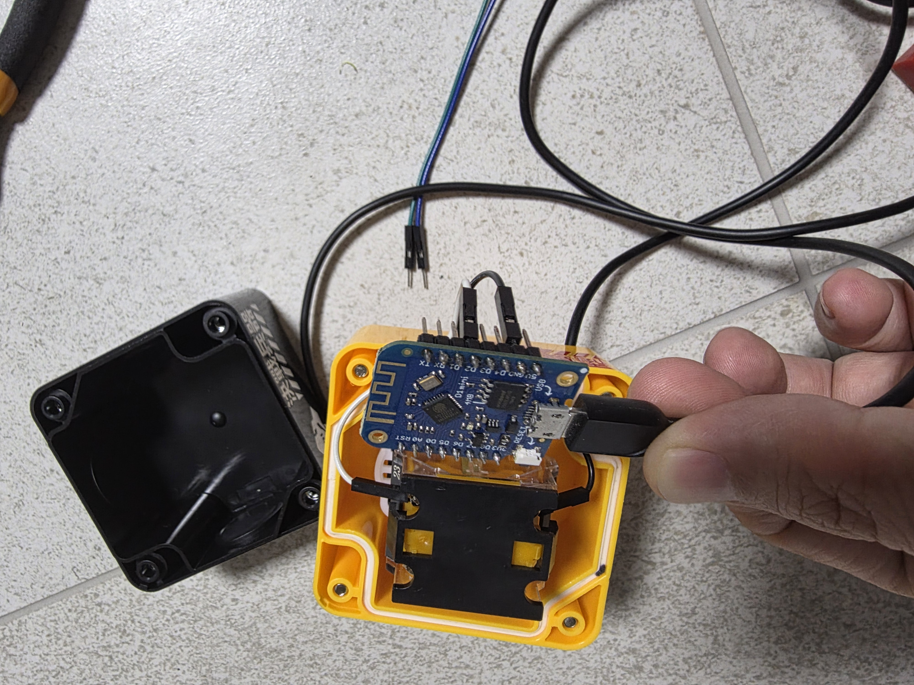
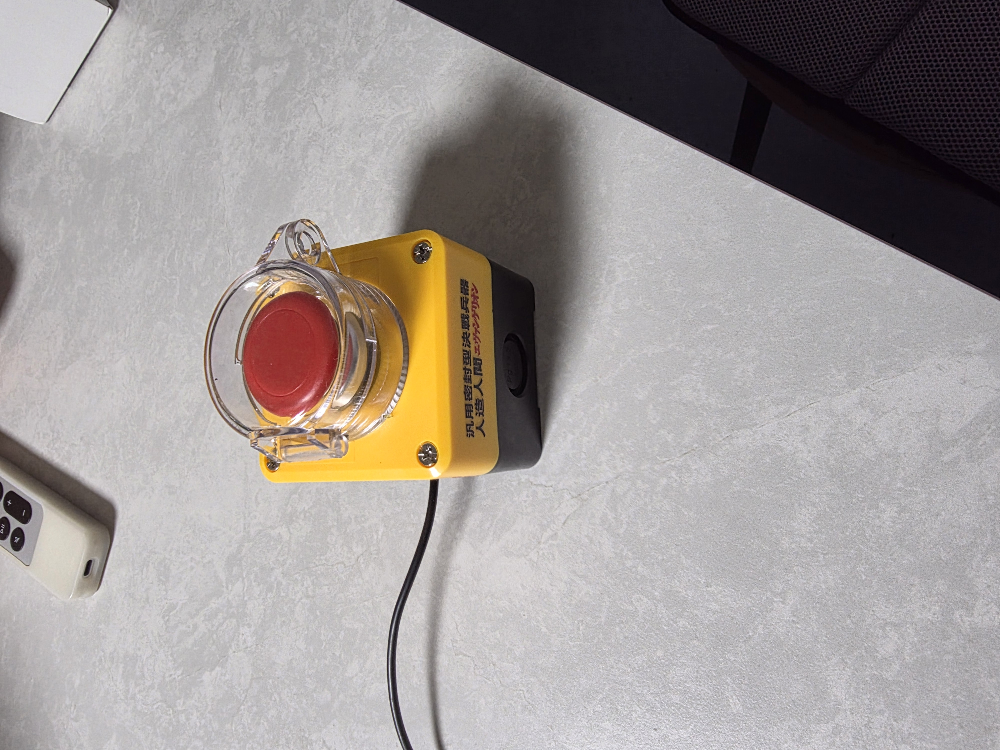

# Neimz Button

A simple button component configuration for ESP8266 (D1 Mini).

## Features

- Detects "Single Click", "Double Click", and "Hold" (Long Press).
- Uses a text sensor (`button_action_sensor`) to publish the button state.

## Wiring (ESP8266 D1 Mini)

| Button | ESP8266 (D1 Mini) |
|---|---|
| SIG / PIN | D2 (GPIO4) |
| GND | GND |

*Note: The pin is configured with an internal pull-up (`pullup: true`) and inverted logic (`inverted: true`). This means the button should connect the D2 pin to GND when pressed.*

## Images

| 1 | 2 | 3 |
|---|---|---|
|  |  |  |

## Purchase Link

[AliExpress](https://ko.aliexpress.com/item/1005006076558656.html)