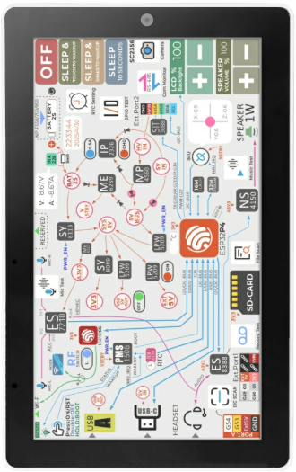
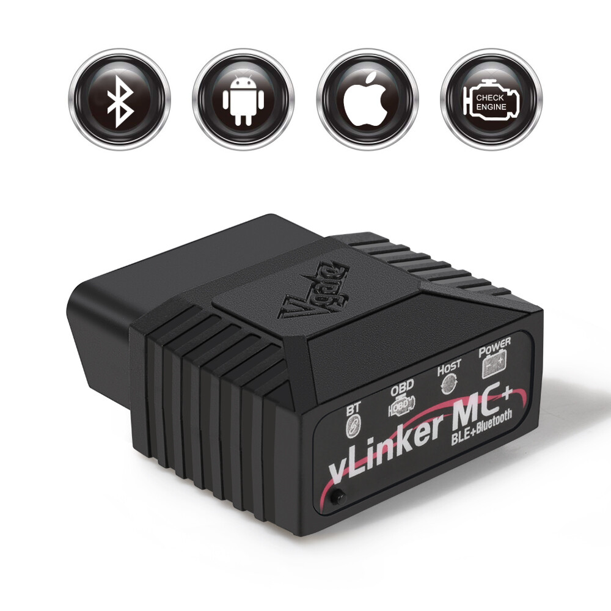
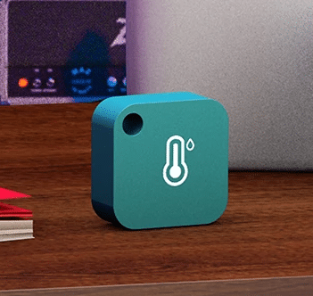
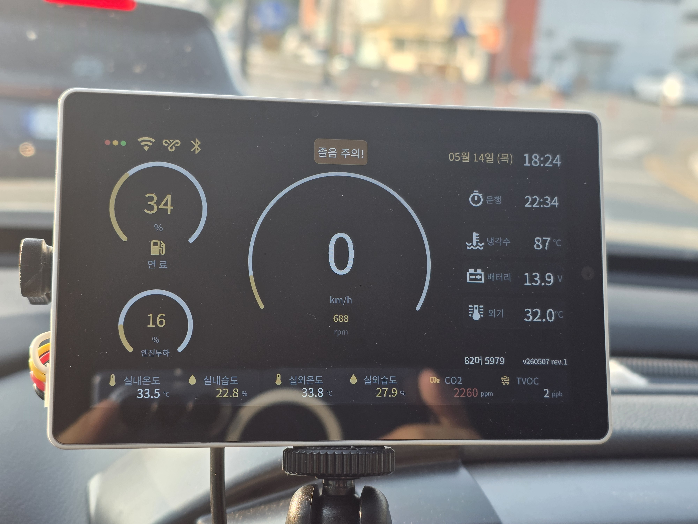

# Colorado Tab5 Dashboard

ESPHome configuration for a vehicle dashboard based on the ESP32-P4 EV Board (`esp32-p4-evboard`). This dashboard provides real-time vehicle telemetry via an OBD2 Bluetooth adapter, climate tracking using BLE sensors, and air quality monitoring.

## Preview

| 1. M5Stack Tab5 | 2. vLinker BLE OBD2 Adapter | 3. Jaalee JHT Climate Sensor |
| :---: | :---: | :---: |
|  |  |  |

### 4. Comprehensive Dashboard Results


## Features

- **Vehicle Telemetry**: Integrates with the custom [ble_elm327](/components/ble_elm327) component to connect to a vLinker BLE OBD2 adapter, exposing Engine RPM, Coolant Temperature, Fuel Level, Engine Load, Speed, Odometer, Gear Position, and Runtime directly as native ESPHome sensors.
- **Climate Monitoring**: Tracks cabin and bed temperature/humidity using the custom [jaalee_jht](/components/jaalee_jht) BLE component.
- **Air Quality**: Monitors CO2, eCO2, and TVOC using onboard SCD4x and SGP30 I2C sensors.
- **Dynamic UI**: LVGL-based UI with dynamic color changes based on sensor values and pop-up alerts for critical conditions (e.g., Overheating, High RPM, Low Fuel, Speeding, Drowsiness Warning via High CO2).
- **Power Management**: Monitors power consumption using INA226 and controls power peripherals (USB power, Quick Charge, Speakers, etc.) via PI4IOE5V6408 I2C GPIO expanders.

## Configuration Usage

Add the following to your ESPHome configuration:

```yaml
substitutions:
  name: "esp-colorado-tab5"
  friendly_name: "ESP Colorado TAB5"
  version: "v260405 rev.1"
  number: "12가 1234"
  mac_vlinker: "C0:25:E8:53:2C:90"
  mac_cabin_jht: "DA:E8:DD:E2:9A:47"
  mac_bed_jht: "F5:A8:DB:76:1A:F5"

packages:
  remote:
    refresh: always
    url: https://github.com/eigger/espcomponents/
    files:
      - packages/display/colorado/colorado-tab5.yaml
```

## Required Secrets

Make sure you have the following defined in your `secrets.yaml`:

- `ota_password`
- `colorado_wifi_ssid`
- `colorado_wifi_password`
- `wifi_ssid`
- `wifi_password`
- `colorado_wg_address`
- `colorado_wg_private_key`
- `wg_peer_endpoint`
- `colorado_wg_peer_public_key`
- `mqtt_broker_local`
- `mqtt_user`
- `mqtt_password`


## Hardware Configurations

### Main Board
- **Board**: `esp32-p4-evboard`
- **I2C Bus (Internal)**: SDA GPIO31, SCL GPIO32
- **I2C Bus (External)**: SDA GPIO53, SCL GPIO54

### BLE Devices
Configure your device MAC addresses via `substitutions` variables as shown in the Configuration Usage.
- **OBD2 BLE Adapter**: `vLinker` (`mac_vlinker`)
- **Cabin Climate Sensor**: `Jaalee JHT` (`mac_cabin_jht`)
- **Bed Climate Sensor**: `Jaalee JHT` (`mac_bed_jht`)
- **External Sensors**: Parses `035D` Manufacturer Data (e.g., parking remote / sensors)

### Sensors & ICs
- **PI4IOE5V6408 (I2C 0x43, 0x44)**: GPIO Expansion handling USB power, Quick charge, external 5V, speaker enable, WiFi antenna switching, charge status, and headphone detection.
- **INA226 (I2C 0x41)**: Battery voltage and current monitoring.
- **SGP30 (I2C 0x58)**: eCO2 and TVOC air quality monitoring.
- **SCD4x**: High accuracy CO2 concentration, temp, and humidity polling.
