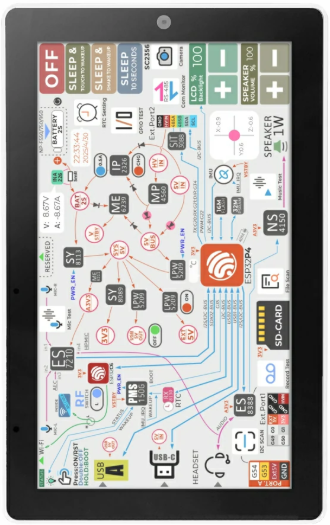
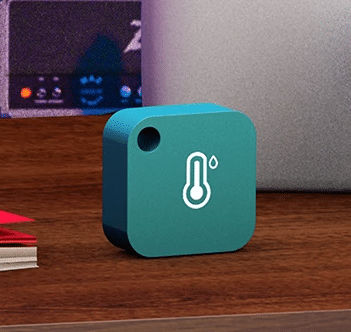
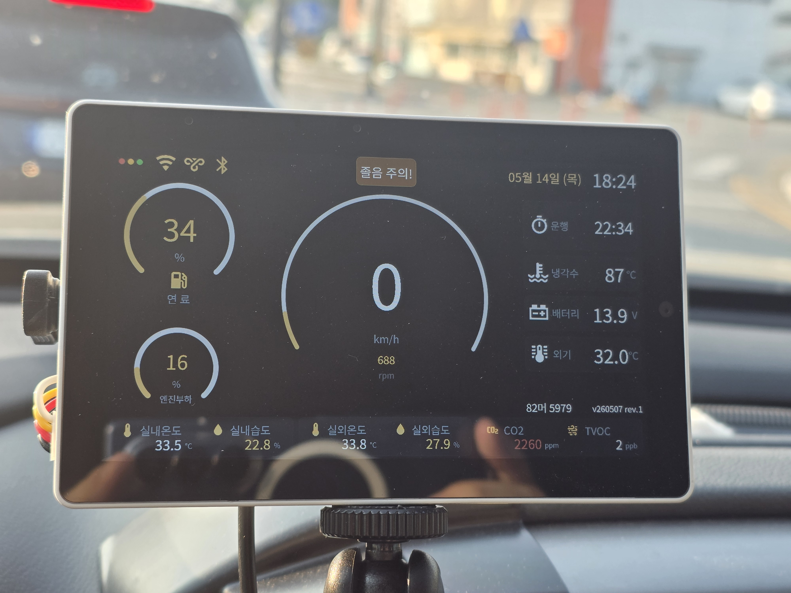
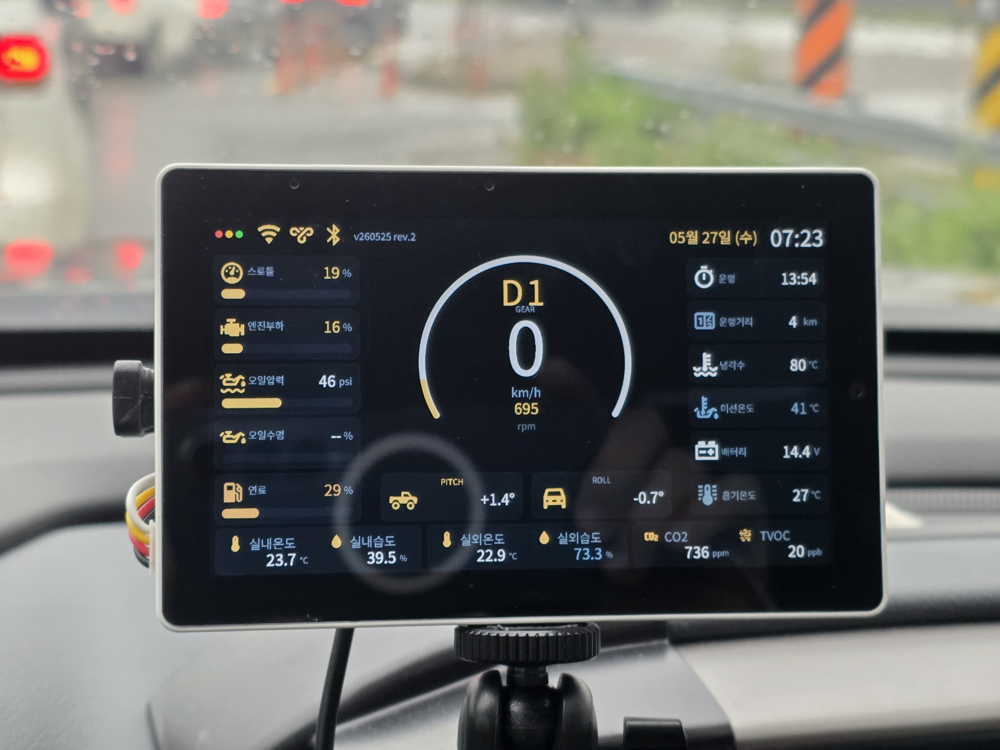

# Colorado Tab5 Dashboard

ESPHome configuration for a vehicle dashboard based on the ESP32-P4 EV Board (`esp32-p4-evboard`). This dashboard provides real-time vehicle telemetry via an OBD2 Bluetooth adapter, climate tracking using BLE sensors, and air quality monitoring.

## Preview

| 1. M5Stack Tab5 | 2. vLinker BLE OBD2 Adapter | 3. Jaalee JHT BLE Sensor |
| :---: | :---: | :---: |
|  |  |  |

### 4. Comprehensive Dashboard Results
| 4 | 5 |
| :---: | :---: |
|  |  |

## Features

- **Vehicle Telemetry**: Integrates with the custom [ble_elm327](/components/ble_elm327) component to connect to a vLinker BLE OBD2 adapter, exposing Engine RPM, Coolant Temperature, Fuel Level (% and GM liters), Engine Load, Speed, Odometer, Gear Position, PRND, and Runtime as native ESPHome sensors.
- **Climate Monitoring**: Tracks cabin and cargo-bed (적재함) temperature/humidity using the custom [jaalee_jht](/components/jaalee_jht) BLE component.
- **Air Quality**: Monitors CO2, eCO2, and TVOC using onboard SCD4x and SGP30 I2C sensors.
- **Dynamic UI**: LVGL-based UI with dynamic color changes based on sensor values and pop-up alerts for critical conditions (e.g., Overheating, High RPM, Low Fuel, Speeding, Drowsiness Warning via High CO2).
- **Power Management**: Monitors power consumption using INA226 and controls power peripherals (USB power, Quick Charge, Speakers, etc.) via PI4IOE5V6408 I2C GPIO expanders.
- **Home Assistant Real-time Sync**: Outbound WebSocket bridge via [ws_bridge](/components/ws_bridge) component, pushing 25+ telemetry and environmental entities directly to Home Assistant without needing an MQTT broker or VPN.

## Configuration Usage

Add the following to your ESPHome configuration:

```yaml
substitutions:
  name: "esp-colorado-tab5"
  friendly_name: "ESP Colorado TAB5"
  number: "12가 1234"
  mac_vlinker: "C0:25:E8:53:2C:90"
  mac_cabin_jht: "DA:E8:DD:E2:9A:47"
  mac_bed_jht: "F5:A8:DB:76:1A:F5"

packages:
  remote:
    refresh: always
    url: https://github.com/eigger/espcomponents/
    files:
      - packages/display/colorado/colorado-tab5.yaml
```

## Home Assistant Integration (`ws_bridge`)

The dashboard connects directly to Home Assistant's `/api/websocket` endpoint over an outbound secure WebSocket (`wss://`) using the custom [ws_bridge](/components/ws_bridge) component and the companion [`hass-ws-bridge`](https://github.com/eigger/hass-ws-bridge) Home Assistant integration.

- **No MQTT / No VPN Needed**: Outbound WSS connection works seamlessly across mobile hotspots, home Wi-Fi, or remote tunnels (e.g., Nabu Casa / Cloudflare).
- **Persistent State**: With `keep_last_state_on_disconnect: true`, vehicle telemetry remains visible in Home Assistant even when the vehicle is parked and offline.
- **Auto Entity Pruning**: `sync_entities: true` automatically removes old or renamed entities on connection while preserving history and long-term statistics.
- **Synchronized Entities (25+)**:
  - **Vehicle Telemetry**: Speed, RPM, Engine Load, Throttle, Acceleration, Gear, PRND, Oil Pressure, Coolant Temp, Transmission Fluid Temp, Intake/Ambient Temp, Fuel Level (% & Liters), Odometer, Trip Distance, Engine Runtime, and Car Battery Voltage.
  - **Cabin & Cargo Climate**: Jaalee JHT temperature, humidity, and battery levels for both cabin and cargo bed (적재함).
  - **Air Quality**: SCD40 CO2/temp/humidity, SGP30 eCO2 & TVOC, and internal device temperatures.
  - **Firmware Update**: Exposes the `ota_update` entity as a native Home Assistant Update card with one-click install.

## OTA Updates (ESPHome OTA Publisher)

To enable remote Over-The-Air (OTA) firmware updates via Home Assistant without exposing local ports or using a VPN, this configuration integrates with the **[ESPHome OTA Publisher](https://github.com/eigger/hassio-apps/tree/master/esphome_ota)** add-on.

1. **Install Add-on**: Install [ESPHome OTA Publisher](https://github.com/eigger/hassio-apps/tree/master/esphome_ota) in Home Assistant.
2. **Register Device**: Register `esp-colorado-tab5` in the add-on UI and build/publish firmware.
3. **OTA Package**: The add-on generates `ota_server/devices/esp-colorado-tab5.yaml` (or `ota_server/update.yaml`), which defines `ota_update` and sets `esphome.project.version`.
4. **Version Management**: The dashboard automatically uses `ESPHOME_PROJECT_VERSION` (`*version`) across boot logs, header version label, splash screen, and `ws_bridge` device info.
5. **Home Assistant Update Entity**: `ws_bridge` exposes `ota_update` to Home Assistant as a native firmware Update entity with install/check features.

## Required Secrets

Make sure you have the following defined in your `secrets.yaml`:

- `ota_password`
- `colorado_wifi_ssid`
- `colorado_wifi_password`
- `wifi_ssid`
- `wifi_password`
- `ha_address`
- `ha_token`


## ble_elm327 Setup (vLinker OBD2)

Production OBD configuration from the Colorado Tab5 dashboard. Tested with a **vLinker MC+** BLE adapter on a **Chevrolet Colorado Z71** (ISO 15765-4 CAN 500 kbps).

### Package include (OBD sensors only)

Add `mac_vlinker` to your substitutions, then include the OBD package. The parent config must already define `esp32`, `esp32_hosted`, and `esp32_ble_tracker` (see `colorado-tab5.yaml` for Tab5 pinout).

```yaml
substitutions:
  mac_vlinker: "C0:25:E8:53:2C:90"   # replace with your adapter MAC

packages:
  remote:
    refresh: always
    url: https://github.com/eigger/espcomponents/
    files:
      - packages/display/colorado/colorado-ble-elm327.yaml
```

Source: [`colorado-ble-elm327.yaml`](colorado-ble-elm327.yaml)

### Minimal standalone example

For a new ESP32 board (non-Tab5: omit `esp32_hosted` and use the board’s native BLE):

```yaml
substitutions:
  mac_vlinker: "AA:BB:CC:DD:EE:FF"

external_components:
  - source: github://eigger/espcomponents
    components: [ ble_elm327 ]
    refresh: always

esp32_ble_tracker:

ble_client:
  - mac_address: ${mac_vlinker}
    id: obd_client

ble_elm327:
  id: obd_elm
  ble_client_id: obd_client
  service_uuid: "18F0"    # vLinker MC+
  rx_char_uuid: "2AF0"
  tx_char_uuid: "2AF1"
  init_commands:
    - "ATSP6"
  tx_delay: 50

sensor:
  - platform: ble_elm327
    name: "Engine RPM"
    preset: rpm
    update_interval: 1s
  - platform: ble_elm327
    name: "Car Speed"
    preset: speed
    update_interval: 1s
  - platform: ble_elm327
    name: "Engine Coolant Temperature"
    preset: coolant_temp
    update_interval: 10s
```

| Setting | vLinker MC+ (Colorado) | Default (many adapters) |
|---------|------------------------|-------------------------|
| `service_uuid` | `18F0` | `FFF0` |
| `rx_char_uuid` | `2AF0` | `FFF1` |
| `tx_char_uuid` | `2AF1` | `FFF2` |
| `init_commands` (extra, after base) | `ATSP6` | omit or `[]` (base only) |

GM extended presets (`gm_fuel_level_liters`, `gm_current_gear`, `gm_prnd_status_alt`, `gm_oil_pressure`, `gm_trans_temp`, …) are vehicle-specific. See the [ble_elm327 component docs](/components/ble_elm327/README.md) for the full preset list and troubleshooting.

### Tab5 BLE prerequisite

M5Stack Tab5 routes BLE through an ESP32-C6 co-processor. Include `esp32_hosted` before `esp32_ble_tracker` — copy the block from [`colorado-tab5.yaml`](colorado-tab5.yaml) (lines 106–116).

## Hardware Configurations

### Main Board
- **Board**: `esp32-p4-evboard`
- **I2C Bus (Internal)**: SDA GPIO31, SCL GPIO32
- **I2C Bus (External)**: SDA GPIO53, SCL GPIO54

### BLE Devices
Configure your device MAC addresses via `substitutions` variables as shown in the Configuration Usage.
- **OBD2 BLE Adapter**: `vLinker` (`mac_vlinker`)
- **Cabin Climate Sensor**: `Jaalee JHT` (`mac_cabin_jht`)
- **Cargo Bed Climate Sensor**: `Jaalee JHT` (`mac_bed_jht`, UI label 적재함)
- **External Sensors**: Parses `035D` Manufacturer Data (e.g., parking remote / sensors)

### Sensors & ICs
- **PI4IOE5V6408 (I2C 0x43, 0x44)**: GPIO Expansion handling USB power, Quick charge, external 5V, speaker enable, WiFi antenna switching, charge status, and headphone detection.
- **INA226 (I2C 0x41)**: Battery voltage and current monitoring.
- **SGP30 (I2C 0x58)**: eCO2 and TVOC air quality monitoring.
- **SCD4x**: High accuracy CO2 concentration, temp, and humidity polling.

## Garage Integration (`hass-garage`)

Vehicle telemetry collected by this dashboard can be automatically forwarded to the self-hosted [Garage](https://github.com/eigger/garage) vehicle management server using the **[hass-garage](https://github.com/eigger/hass-garage)** Home Assistant custom integration.

- **Zero YAML Configuration**: No need for manual `rest_command` or complex automations. Configure entirely through the Home Assistant UI.
- **Automatic Telemetry Stream**: Select the entities exposed by `ws_bridge` (Speed, RPM, Fuel Level, Odometer, and your phone's GPS `device_tracker`), and `hass-garage` automatically syncs telemetry to Garage whenever driving metrics change.
- **Two-way Sync**: Garage service reminders (due/upcoming maintenance) and last known parking location are automatically published back to Home Assistant sensors.
