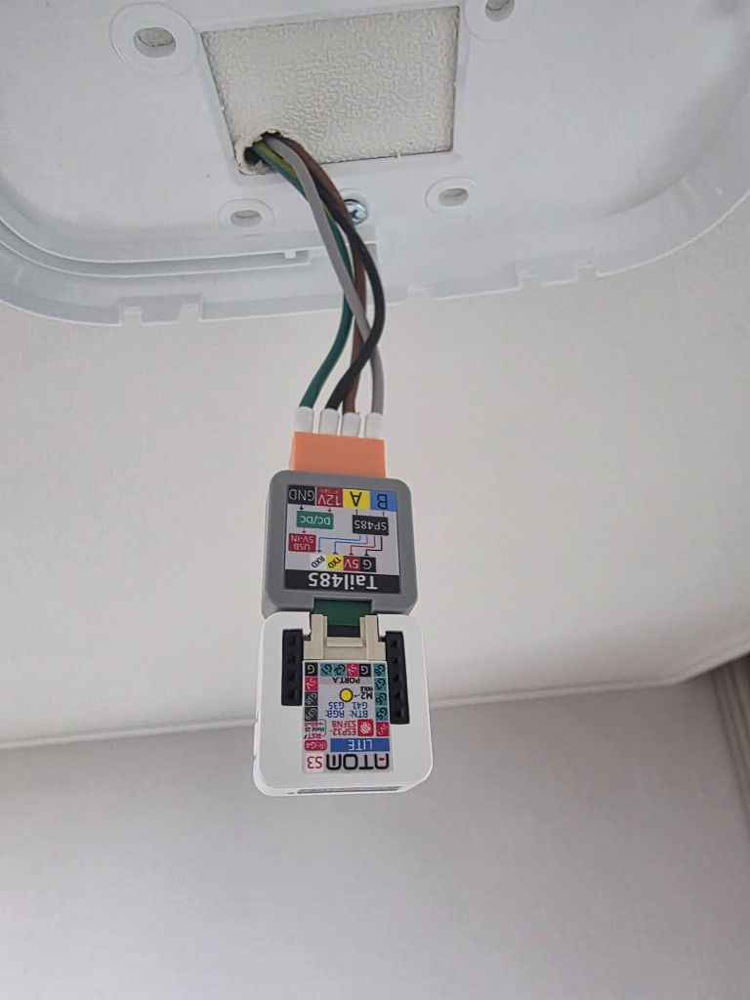
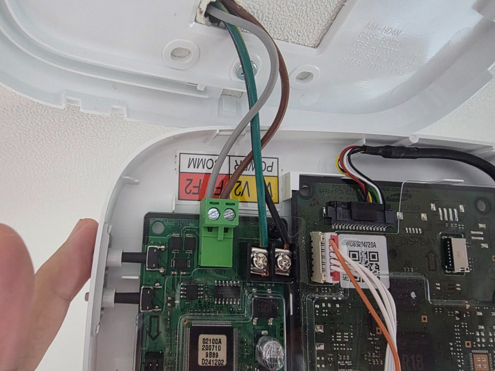

# 삼성 시스템 에어컨 (NASA 프로토콜) ESPHome 패키지

M5Stack AtomS3 Lite와 Tail485 (Atom Tail RS485) 모듈을 이용하여 삼성 시스템 에어컨(NASA 통신 프로토콜)을 RS-485 F1/F2 버스에 연결하고 Home Assistant와 직접 연동하는 ESPHome 외부 패키지입니다.

---

## 🛠️ 1. 하드웨어 구성 및 실물 배선 (Hardware & Wiring)

| 항목 | 제품명 | 비고 |
| :--- | :--- | :--- |
| **메인 컨트롤러** | M5Stack AtomS3 Lite (ESP32-S3) | 초소형 ESP32-S3 컨트롤러 보드 |
| **RS485 트랜시버** | M5Stack Tail485 (Atom Tail RS485) | RS485 통신 변환 및 12V DC-DC 내장 모듈 |
| **에어컨 결선** | 삼성 F1 / F2 통신선 + V1 / V2 전원선 | 벽면 리모컨 라인 배선 활용 |

---

### 📷 1) AtomS3 Lite + Tail485 모듈 실제 배선 사진
Tail485 모듈 4핀 터미널 블록(`B`, `A`, `12V`, `GND`)에 벽면 전원/통신 라인을 연결합니다.

<br>

<br>

#### 📌 Tail485 결선 핀 맵
* **`B` (파란색 단자)**: 삼성 **F2** 통신선 (회색)
* **`A` (노란색 단자)**: 삼성 **F1** 통신선 (갈색)
* **`12V` (빨간색 단자)**: 삼성 **V1** 12V 전원선 (검은색)
* **`GND` (검은색 단자)**: 삼성 **V2** GND 전원선 (초록색)

---

### 📷 2) 삼성 에어컨 유선 리모컨 / Wi-Fi 키트 기판 단자 구조 (참고)
벽면 내부 서브 PCB (AIM-H04N 등)의 **F1 / F2** (통신) 및 **V1 / V2** (12V 전원) 단자 위치 구조입니다.

<br>

<br>

---

### 📌 ESP32 핀 맵 (Pinout) 및 통신 규격
* **UART Port**: UART0
* **RX Pin**: `GPIO01` (AtomS3 Lite Groove/Bottom RX)
* **TX Pin**: `GPIO02` (AtomS3 Lite Groove/Bottom TX)
* **Baud Rate**: `9600 bps`
* **Parity**: `EVEN` (8E1)

---

## 🚀 2. ESPHome 구성 방법 (Usage)

본 패키지를 사용하려면 기존 ESPHome 설정 파일의 `packages` 항목에 아래 리모트 패키지를 추가하시면 됩니다:

```yaml
packages:
  remote:
    refresh: always
    url: https://github.com/eigger/espcomponents/
    files:
      - packages/hvac/samsung/samsung_ac.yaml
```

---

## ✨ 3. 주요 기능 및 특징

### 1) AI Auto (AI 쾌적) 모드 완전 지원
* `map_auto_to_heat_cool: false` 설정을 통해 Home Assistant에서 `Auto` 모드를 선택할 때, 삼성 에어컨 고유의 **AI Auto 모드 (`ENUM_in_operation_mode (0x4001) = 0`)** 명령을 전송합니다.

### 2) 프리셋 지원
* **무풍 (Windfree)** 및 **롱파워/롱리치 (Longreach)** 기능 지원.

### 3) 실시간 동작 상태 텍스트 센서 (`text_sensor`)
* **Real Mode (`0x4002`)**: 실제 동작 중인 모드 (`Auto`, `Cool`, `Dry`, `Fan`, `Heat`, `Off`)
* **Real Fan Speed (`0x4007`)**: 실제 바람 세기 (`Auto`, `Low`, `Mid`, `High`, `Turbo`, `Windfree`, `Off`)
* **Alt Mode (`0x4060`)**: 서브 특수 운전 상태 (`Normal`, `Sleep`, `Quiet`, `Fast`, `Longreach`, `Windfree`, `Off`)
* **4-Way Valve Status (`0x801A`)**: 실외기 사방밸브 인가 상태 (`Cooling (Off)`, `Heating (On)`)

### 4) 예외값 방어 필터링 (Invalid Value Safeguard)
* 에어컨 유휴/Off 상태 시 발생하는 무효값(`254`, `255`, `65535`, `32767`)을 자동으로 필터링 및 `"Off"` 상태로 안전하게 전환 처리합니다.

### 5) 온도/전류 센서 정확도 스케일링
* 실외기 토출 압축기 상부 온도 (`0x8280`), 배관 입/출구 온도 (`0x8264`, `0x8265`, `0x8261`) 등의 10배율 Raw 정수 데이터를 `multiply: 0.1`로 스케일링하여 소수점 1자리 실수값(°C)으로 정확하게 표기합니다.

### 6) 미세먼지 및 요구 용량 센서
* PM10, PM2.5, PM1.0 미세먼지 수치 (`µg/m³`)
* 실내기 요구 용량 부하 (`%`)