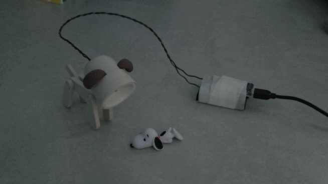
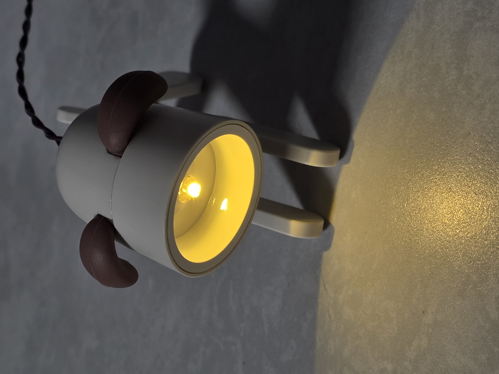
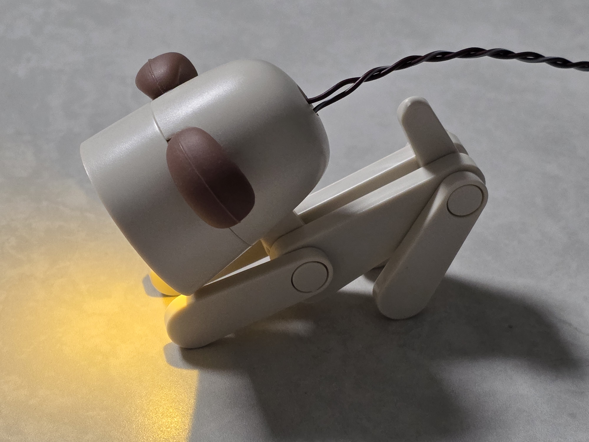
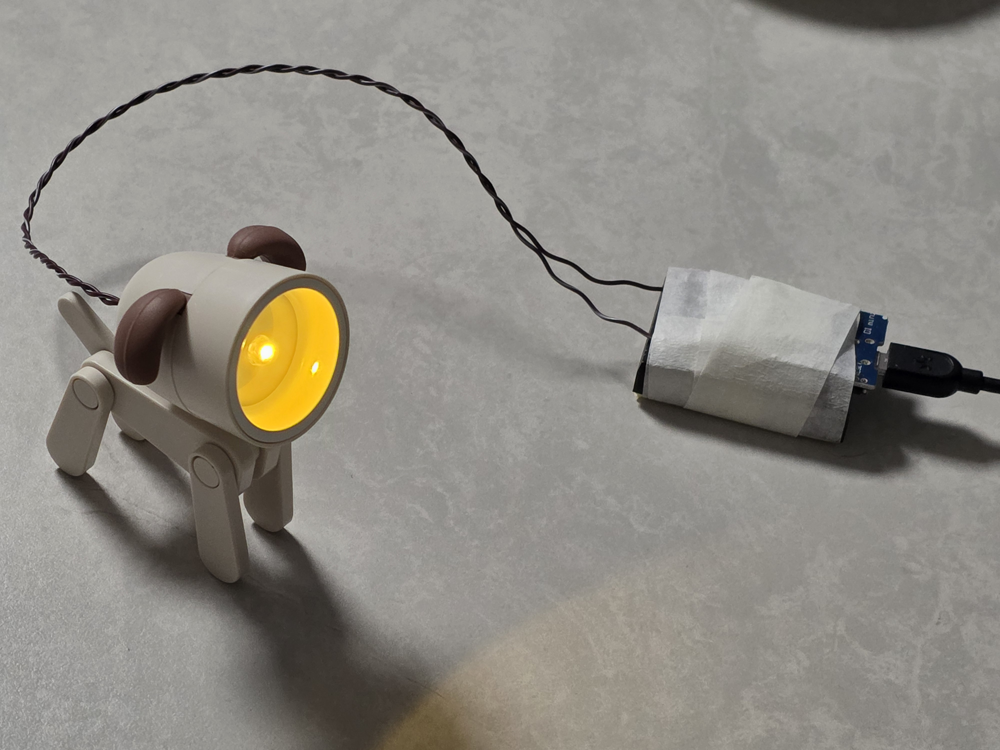
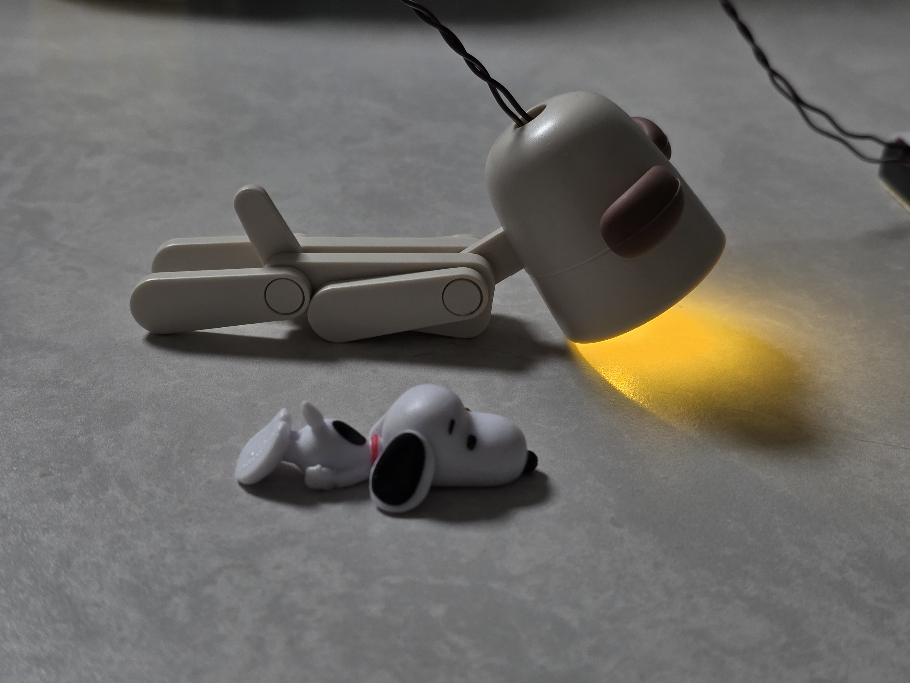

# Puppy LED Lamp

ESPHome configuration for a small dog-shaped LED lamp based on the Wemos D1 Mini (ESP8266). This package provides a simple monochromatic light with PWM dimming control.

## Where to Buy

- [AliExpress - Mini Puppy Table Lamp](https://ko.aliexpress.com/item/1005011925580834.html)

## Features

- **PWM Dimming**: Smooth brightness control for the LED.
- **Smart Integration**: Easily control the lamp via Home Assistant or the ESPHome web interface.

## Configuration Usage

Add the following to your ESPHome configuration:

```yaml
substitutions:
  name: "puppy-led"
  friendly_name: "Puppy LED"

packages:
  remote:
    refresh: always
    url: https://github.com/eigger/espcomponents/
    files:
      - packages/led/puppy_d1_mini.yaml
```

## Hardware Configuration

### Board
- **Board**: `d1_mini` (ESP8266)

### Wiring

- **Pin D6 (GPIO12)** <-> Resistor <-> LED (+)
- **GND** <-> LED (-)
  
## Gallery

<div align="center">
  
  
</div>
<div align="center">
  
  
  
</div>


