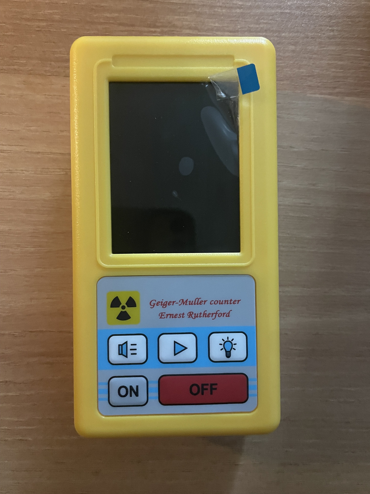
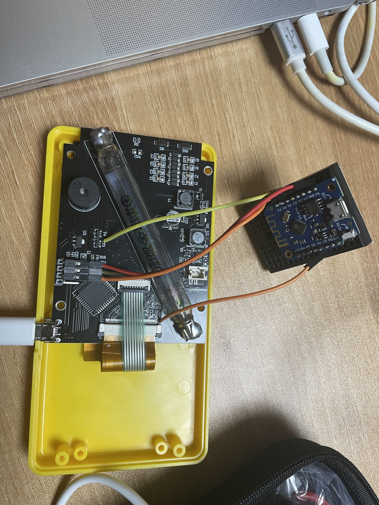
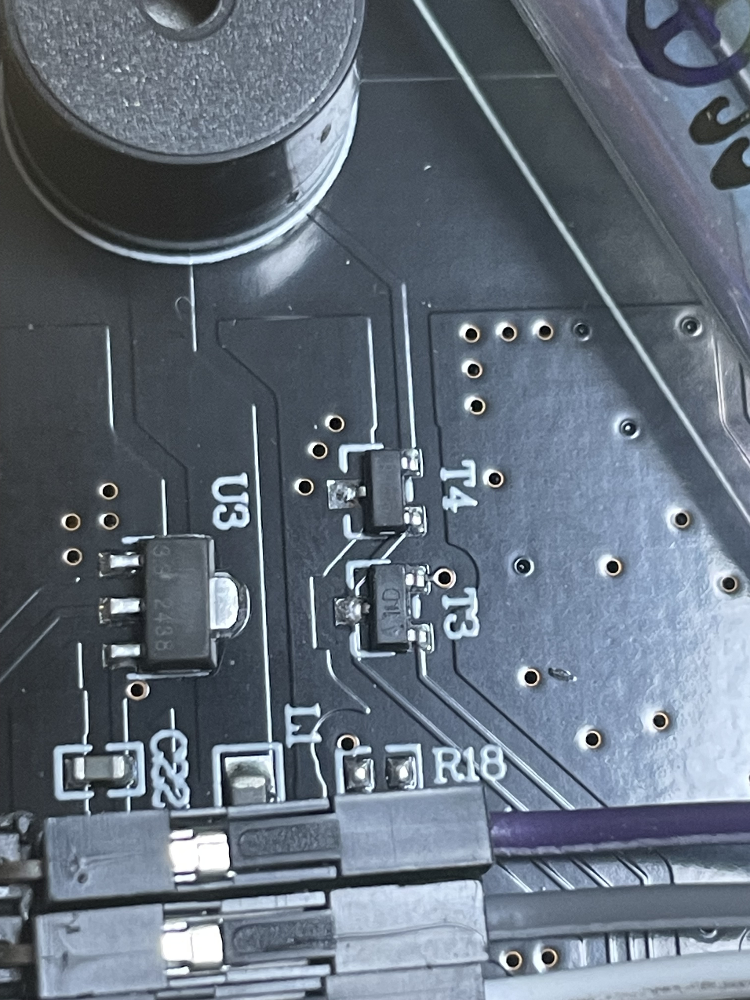
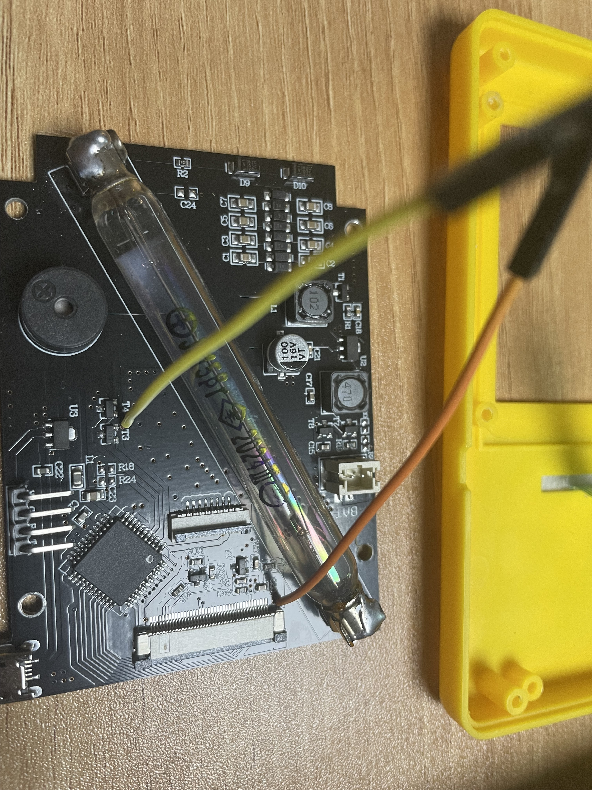
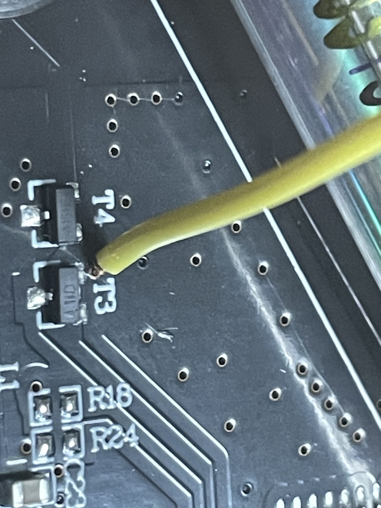
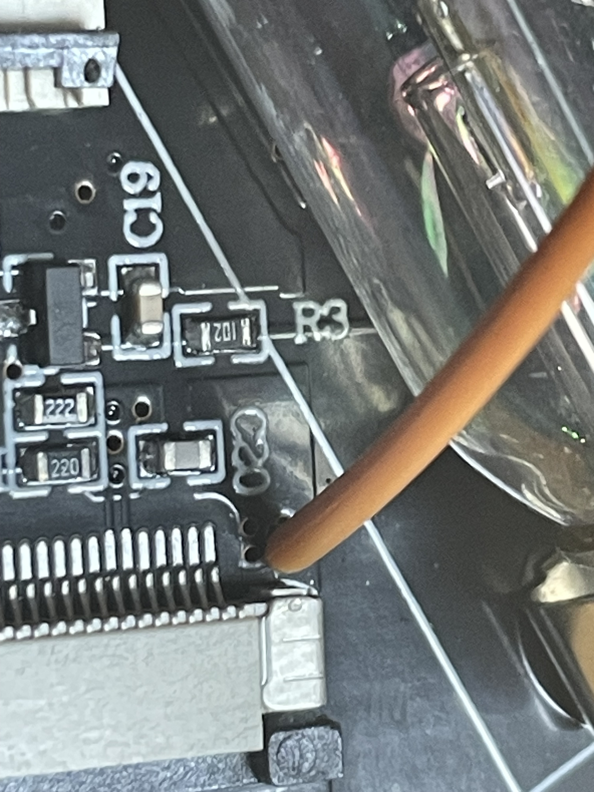
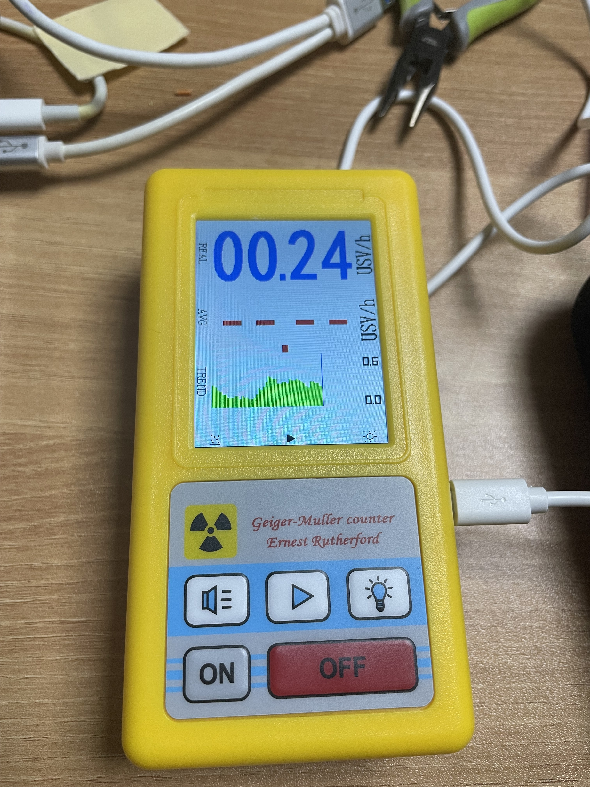
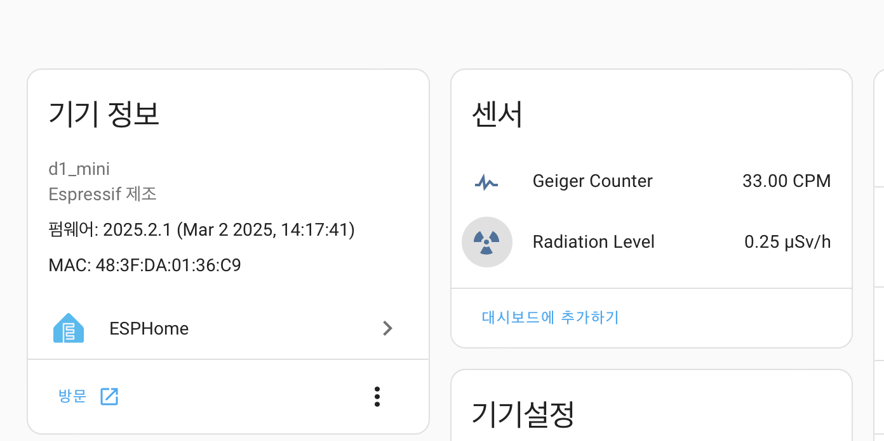

## Wiring (ESP8266)

T3 <-> GPIO4 (D2)  
T5 <-> GPIO12 (D6)  

### Header Pins

V <-> 5V  
G <-> GND  
R <-> GPIO5 (D1)  

## Images

| 1 | 2 | 3 | 4 |
|---|---|---|---|
|  |  |  |  |

| 5 | 6 | 7 | 8 |
|---|---|---|---|
|  |  |  |  |

