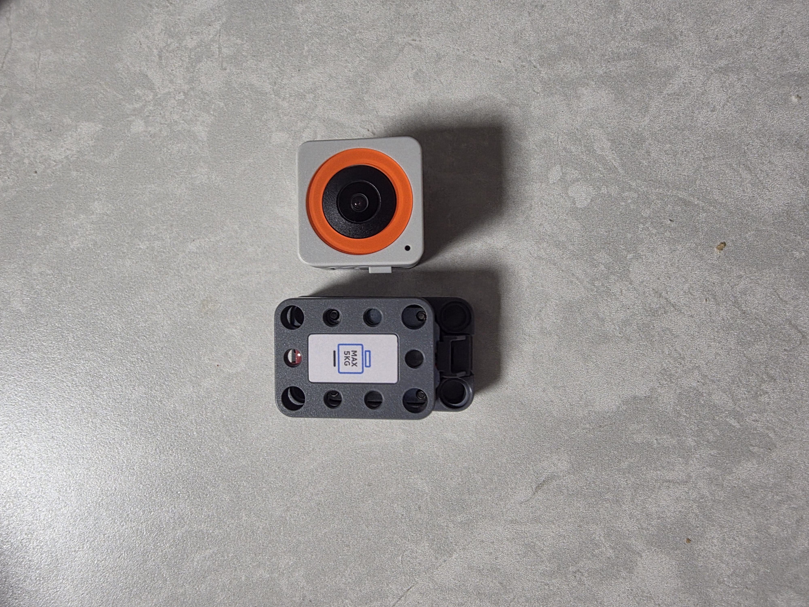
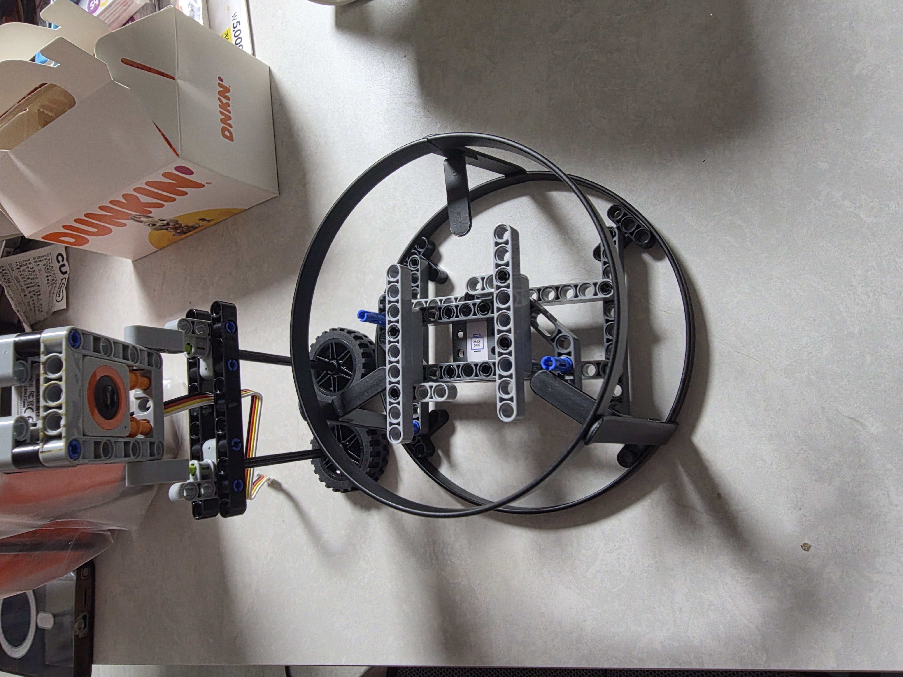
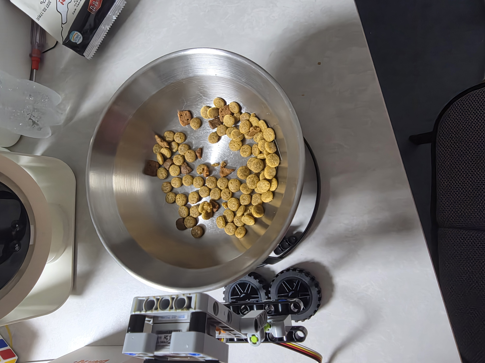
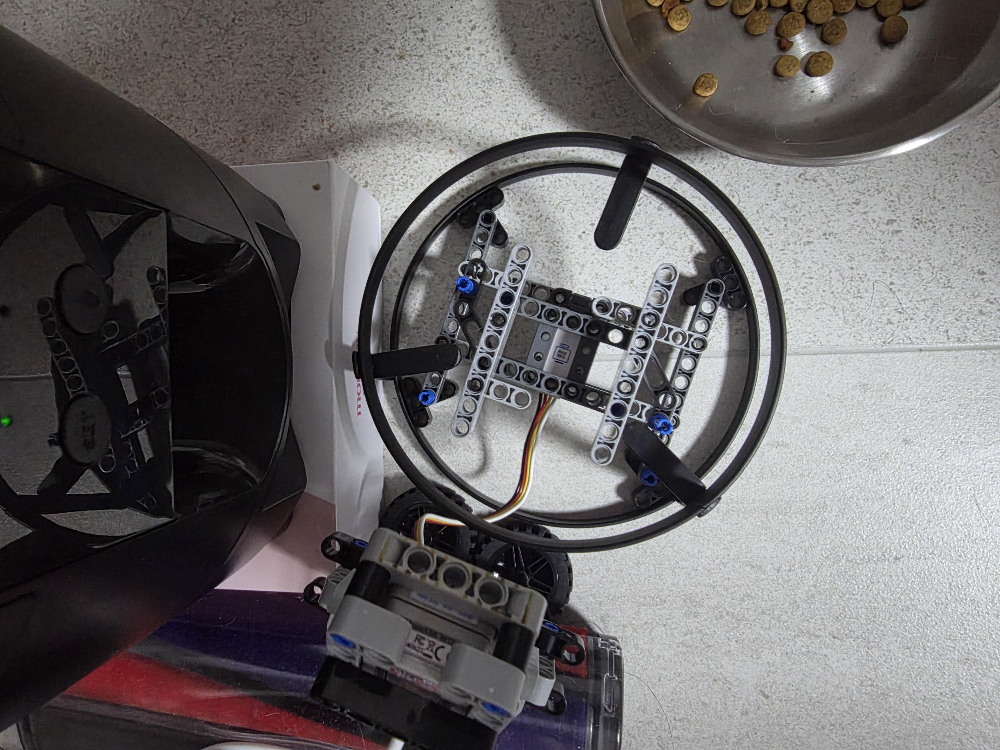
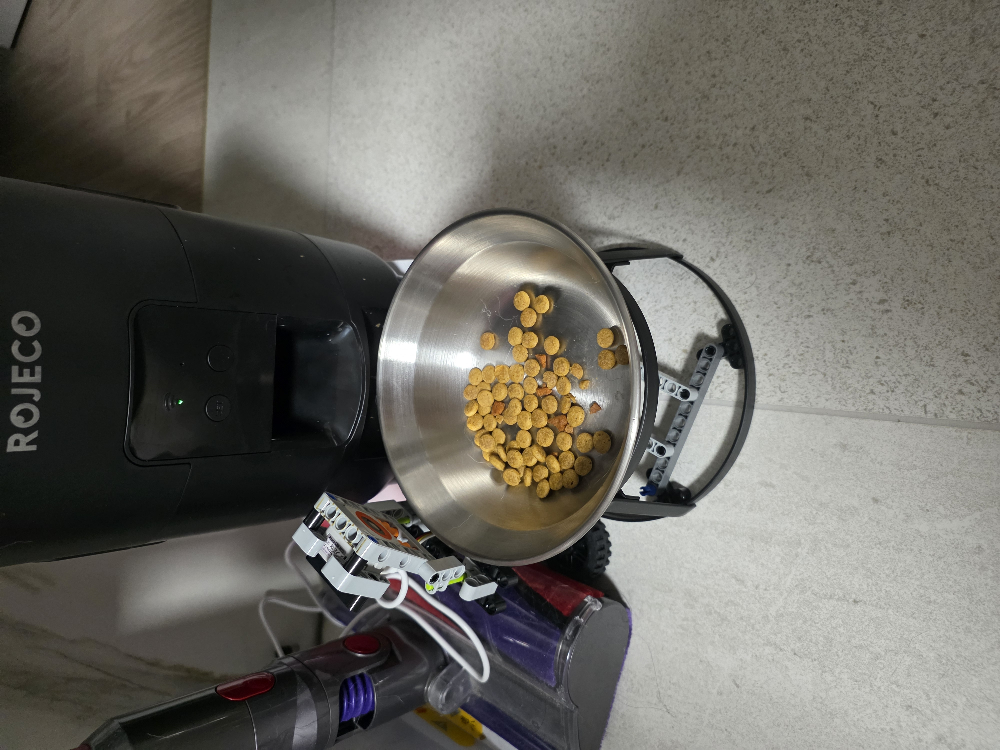
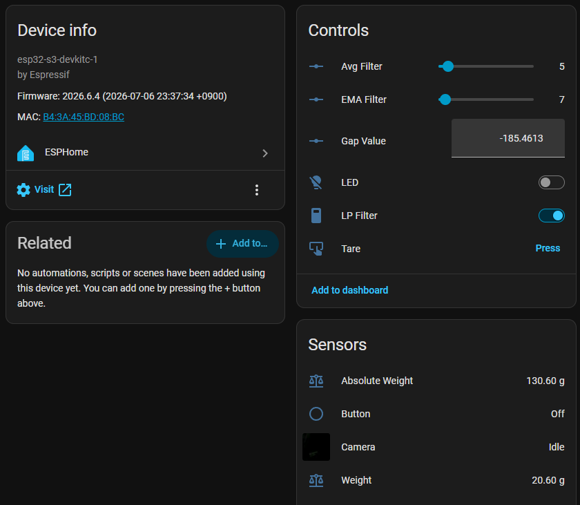

# Pet Food Bowl Scale (Pet Scale)

This project is a smart pet (cat) food bowl scale built by assembling the **M5Stack AtomS3R-M12** and the **M5Stack Unit-Mini Scales** using Lego bricks. It allows you to monitor food weight and check on your pet via live camera feed.

## Features

- **Precision Weight Monitoring**: Tracks real-time weight and absolute weight of the pet food bowl.
- **Live Video Streaming**: Streams video at 320x240 @ 2fps YUV422 using the AtomS3R-M12's onboard GC0308 camera.
- **Tare Control**: Zero-point calibration to subtract the food bowl's base weight.
- **Status RGB LED**: Controls the addressable WS2812 RGB LED built into the Unit-Mini Scales.
- **Digital Filters**: Fine-tunes sensor readings with low-pass (LP), average, and exponential moving average (EMA) filters.

---

## ESPHome Configuration Usage

To use this package, add the following to your ESPHome configuration file:

```yaml
substitutions:
  name: "esp-atom-scale"
  friendly_name: "ESP Atom Scale"

packages:
  remote:
    refresh: always
    url: https://github.com/eigger/espcomponents/
    files:
      - packages/device_base.yaml
      - packages/esp32.yaml
      - packages/scale/pet_scale.yaml
```

---

## Hardware Specifications & Pin Mapping

### Devices

| M5Stack AtomS3R-M12 | M5Stack Unit-Mini Scales |
|---|---|
|  |  |


### 1. Weight Sensor (I2C)
The Unit-Mini Scales is connected via the Grove port:
- **SDA**: GPIO2
- **SCL**: GPIO1
- **I2C Address**: `0x26`

### 2. Camera Module
The onboard GC0308 camera on the AtomS3R-M12 uses the following pin map:
- **I2C SDA**: GPIO12 (CAM_SDA)
- **I2C SCL**: GPIO9 (CAM_SCL)
- **Camera Power/Init Pin**: GPIO18 (Inverted, must be turned ON at boot)
- **VSYNC / HREF / PCLK**: GPIO10 / GPIO14 / GPIO40
- **Data Pins (Y2-9)**: [GPIO3, GPIO42, GPIO46, GPIO48, GPIO4, GPIO17, GPIO11, GPIO13]

---

## Gallery (Assembly & Operation)

| Photo | Description |
|---|---|
|  | **1. Before Assembly**: AtomS3R-M12 and Unit-Mini Scales before Lego assembly. |
|  | **2. Assembled**: Assembled Lego structure with the AtomS3R-M12 and Unit-Mini Scales. |
|  | **3. With Food Bowl**: The assembled Lego scale structure with the pet food bowl placed on it. |
|  | **4. Placement (No Bowl)**: The setup positioned at the actual feeding spot (without the bowl). |
|  | **5. Final Setup**: The final setup positioned at the actual feeding spot with the food bowl ready. |
|  | **6. Home Assistant Dashboard**: Real-time entities, controls, and sensor values displayed in the Home Assistant UI. |

